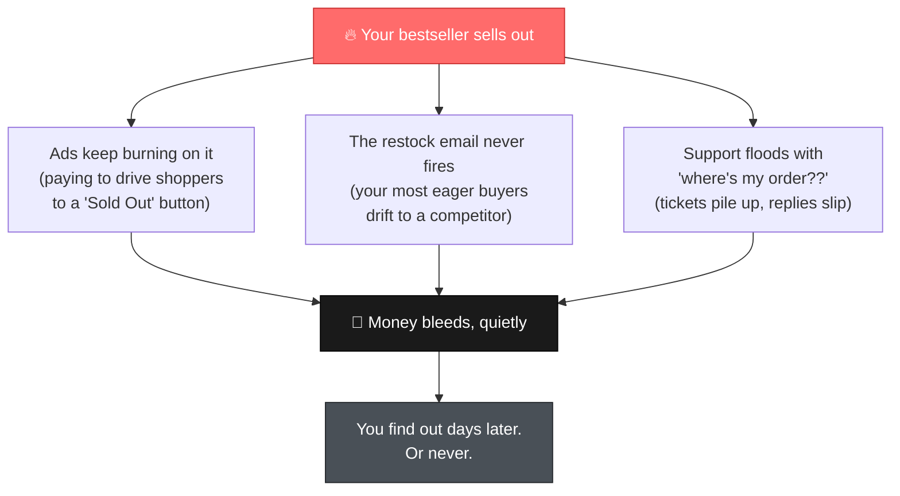
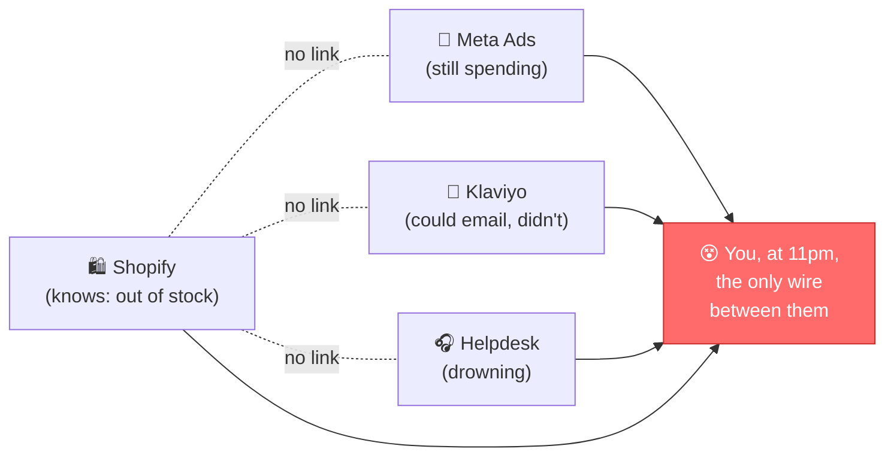
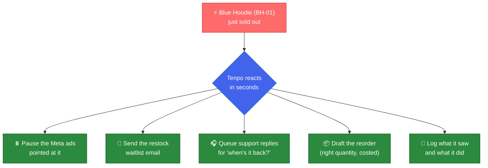
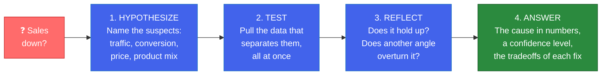
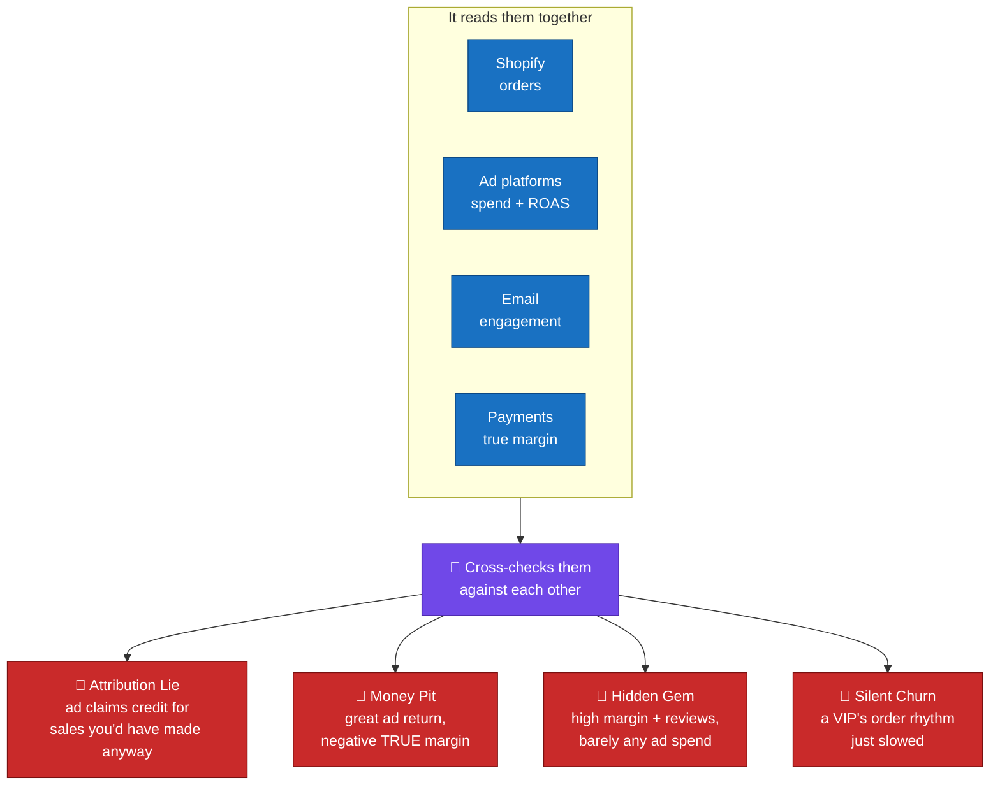
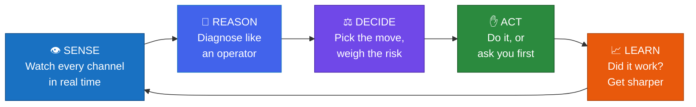
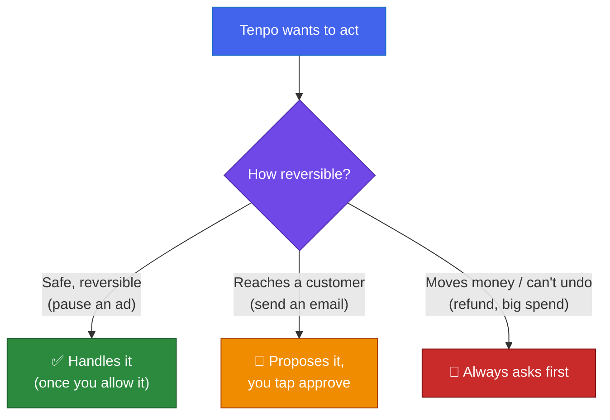
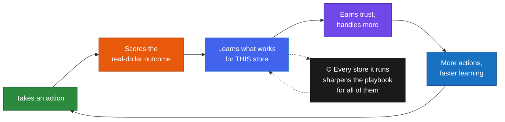

# Tenpo

### Software sold you tools. Now AI sells you the work.

---

## The problem

Running an e-commerce store is brutally complex. You sell across Shopify, Amazon, and TikTok. You run a dozen apps for ads, email, reviews, support, shipping, and analytics, and none of them talk to each other. So the owner ends up stitching data across ten tabs at 11pm, doing work they never signed up for.

So money bleeds, quietly.

It's not one big fire. It's a hundred small leaks: the ad that kept spending, the email that never sent, the reorder you forgot. Each is tiny. Together they're the difference between a store that grows and one that just survives.

And the part that stings:

> ### Every tool did its job. The store still bled.

Shopify knew you were out of stock. Meta had no idea, so it kept spending. Klaviyo could have emailed your waitlist, but nobody pulled the trigger. The information always existed. It just never connected into action, because **you** were the only thing connecting it, and you were asleep.

---

## Every tool was built for a human to do the work

This is the deeper reason. Look at any software you've ever bought. The dashboard assumes you'll read it. The form assumes you'll fill it. The report assumes you'll notice the problem and go fix it.

For decades, "software" has meant a faster place for a _human_ to do data entry: type, click, copy, reconcile, decide. The software organized the work and handed it right back to you. You were the engine. The tool was just the dashboard on top of you.

For the first time in computing history, that assumption is breaking. **The human doesn't have to do the data entry anymore.**

---

## The AI race is aimed at the wrong thing

Almost everyone building AI right now is automating _creative_ work: ads, copywriting, video generation, images, emails. And at that work, AI is still sloppy. Generic copy that sounds like every other AI, hollow video, emails you rewrite anyway. Taste and originality are exactly where the machine is weakest.

The one thing AI is genuinely good at is executing a clear sequence. See this, do that, check the result. Step 1, step 2, step 3.

**That is exactly what operations is.** The most valuable, most repetitive, most draining work in a store is the one thing AI can actually do well, and almost nobody is building it, because a boring reorder doesn't demo as well as a flashy video.

That gap is Tenpo.

> ## "Software sold you tools. Now AI sells you the work."
>
> the thesis Y Combinator is betting this era on

You don't get another dashboard to stare at. You get the work, done.

> ### Tenpo doesn't watch your store. It runs it.

---

## What Tenpo does

When something changes in your store, Tenpo reacts across every connected tool in seconds.

One event, five coordinated actions, automatically. And it's not just stockouts. The same engine handles the long tail:

| What happens                  | What a tired owner does | What Tenpo does                                     |
| ----------------------------- | ----------------------- | --------------------------------------------------- |
| Bestseller sells out          | Notices days later      | Pauses ads, emails the waitlist, drafts the reorder |
| A VIP goes quiet              | Never notices           | Flags the churn risk, proposes a win-back           |
| Ad spend stops converting     | Checks "next week"      | Catches the ROAS drop, proposes a budget shift      |
| Returns spike on a product    | Buried in a spreadsheet | Surfaces it with the dollar impact and likely cause |
| Cash is tight, reorder is due | Agonizes alone          | Runs the runway math, lays out the tradeoff         |

---

## How it thinks

Most "AI assistants" are search boxes: you ask, they look something up. Tenpo reasons like an operator. Ask _"why are my sales down?"_ and it runs the play a good analyst runs:

It names the suspects, pulls the data that tells them apart, checks whether one factor overturns another, and lands on a cause with a confidence level and the tradeoffs of each fix. If it's only 70% sure, it says so, and tells you the one number that would make it sure.

---

## What it knows: the operator's playbooks

Underneath the reasoning, Tenpo carries the decision frameworks an elite operator (a Harvard MBA, an experienced CFO) actually uses. Not buzzwords. The real math, with the thresholds and decision trees built in:

| Framework                | The question it answers                                                                                                                                                                                                                                       |
| ------------------------ | ------------------------------------------------------------------------------------------------------------------------------------------------------------------------------------------------------------------------------------------------------------- |
| **Unit economics**       | What does each order _truly_ net after COGS, fees, shipping, and returns? (The full CM1 → CM2 → CM3 ladder, not the gross margin most owners quote.) It catches products you're selling at a loss without knowing it.                                         |
| **Portfolio triage**     | Which products to scale, hold, test, or kill, scored on real growth velocity and true margin, with guards so it never kills a SKU that's just seasonal or just out of stock.                                                                                  |
| **CAC, LTV and payback** | Is that ad channel _actually_ profitable or just _reported_ profitable? Real cohort lifetime-value curves, payback period, and a when-to-scale rule, including the incrementality check that exposes channels taking credit for sales you'd have made anyway. |
| **Cash vs growth**       | Reinvest, build a buffer, or pay down a supplier? Runway math and the cash-conversion-cycle, so you never run out of cash while scaling.                                                                                                                      |
| **Pricing elasticity**   | Should you change a price, by how much, and how do you read the result, including reading elasticity without a formal experiment and the psychological price points that move conversion?                                                                     |
| **Marketing mix**        | Where does the budget truly work, by marginal return, with cannibalization detection so you stop paying for customers you already had?                                                                                                                        |

It loads the right playbook for the question automatically. Ask about cash, it reasons with the runway framework. Ask which products to drop, it reasons with portfolio triage. Underneath sit 200-plus playbooks in total, plus a library of persuasion principles it pulls from when it writes anything a customer will read.

---

## How it spots what you can't

The biggest wins hide _between_ your tools, in patterns no single app can see. Tenpo reads Shopify, your ad platforms, email, payments, and support _together_, and watches for the traps that quietly drain stores:

- **The Attribution Lie.** Meta reports a 4x return, but Shopify shows your orders didn't grow when you raised the budget. The ad is taking credit for sales that would have happened anyway. Tenpo catches it by checking the platform's claim against real order volume.
- **The Money Pit.** A product with a great ad return but a _negative_ margin once you count COGS, shipping, and returns. You are scaling a loss. Tenpo flags it before you pour in more spend.
- **The Hidden Gem.** A product with strong reviews and high margin that is barely getting any ad spend. An underfunded winner. Tenpo surfaces it so you can double down.
- **Silent Churn.** Your VIPs have not "lapsed" yet, but their order rhythm just slowed. Tenpo catches the drift early, while a win-back still works.

Every finding comes with the dollar impact and a confidence level, ranked so you see the biggest lever first.

And it remembers. What it learns about your store, your margins, your customers, and what you've told it before carries across every conversation. It does not start from zero every morning.

---

## How it works

Everything runs on one loop:

You hold the dial. Every action is sorted by how reversible it is:

It starts by proposing everything for one-tap approval, and earns the right to run the safe stuff on its own. The risky stuff always asks. There's a kill switch. It earns autonomy; you never lose control.

---

## How it gets better

Every action it takes, it scores in real dollars. It paused those ads: did revenue hold? It sent that win-back: did the customer return? It measures the outcome, remembers what worked, and feeds that into the next decision.

A normal tool is exactly as good on day 1,000 as it was on day 1. Tenpo gets sharper every week, because it's the only thing that closes the loop from action to outcome to learning. It compounds two ways: for your store (your customers, margins, suppliers) and across every store it runs.

---

## Why it matters

There are millions of stores, nearly all run by someone drowning in the same operational chaos, losing money to the same quiet leaks every day. The tools era automated the _clicking_. The AI era automates the _deciding and doing_.

Tenpo gives the owner back the one thing they wanted: a store that runs well, and their nights back. An operator that watches everything, handles the safe work, asks about the big calls, scores every move in dollars, and gets smarter every day.

That's not a better dashboard. It's a different category.

---

## Under the hood (a little tech)

- **Real-time senses.** Live webhooks from Shopify and every tool stream in the instant something changes, so it reacts in seconds, not a nightly batch.
- **A reflex and a brain.** Known patterns (stockout, so pause ads, so email the waitlist) fire instantly through a fast deterministic engine. Situations nobody pre-programmed go to the reasoning brain, which diagnoses and proposes a move. It doesn't need a rule for everything; it can think.
- **One safety layer.** Reflex or brain, every action passes the same gates: how reversible, has the owner allowed it, are we live, plus anti-runaway guards (kill switch, no duplicates, daily caps). It fails safe: anything it's unsure about, it proposes instead of doing.
- **It keeps receipts.** Every action gets a dollar-scored before/after, so "did it work" is measured, not guessed. That's the fuel for the learning loop.
- **Proof before power.** Before touching a real store, we can replay any scenario across every autonomy setting and watch exactly what it would do.
