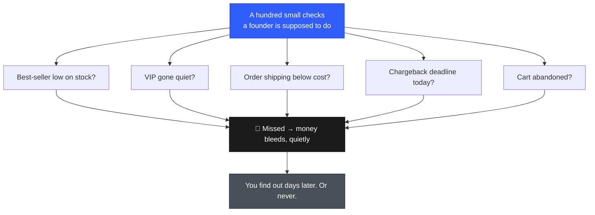
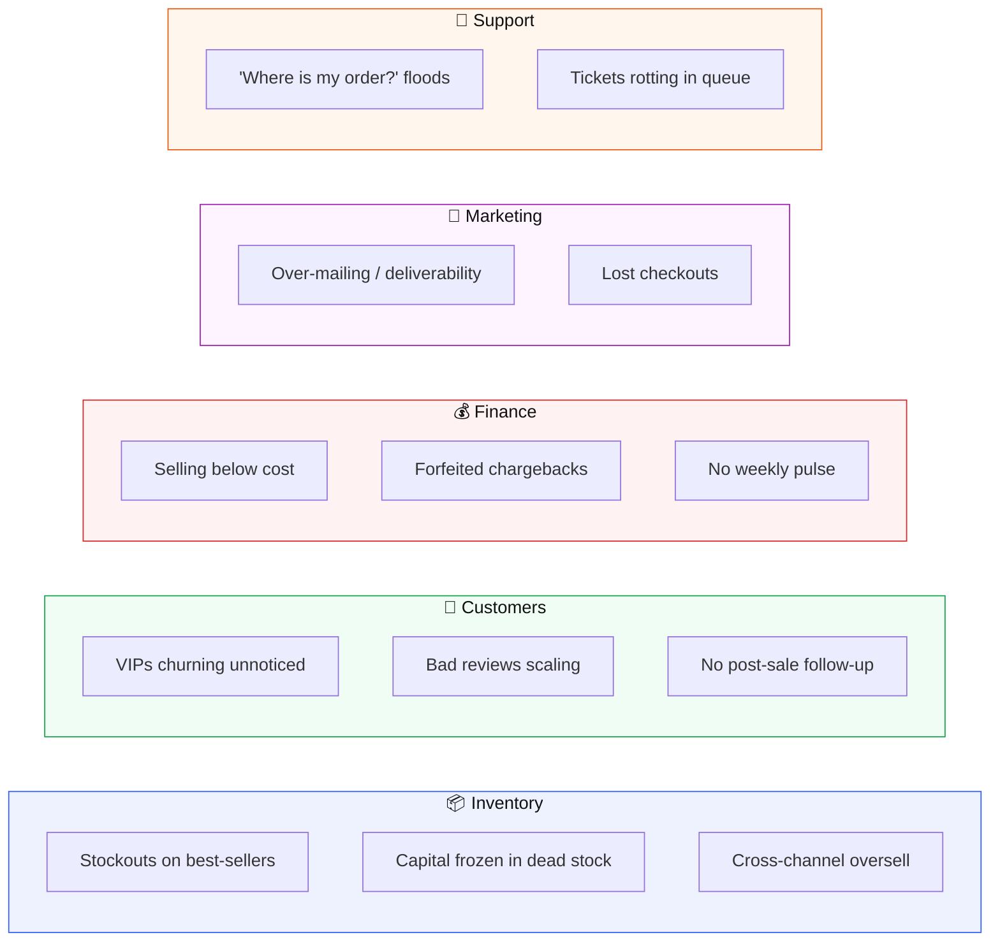

# The Workflow Library

### We asked what actually costs merchants money. Then we built a machine for each answer.

---

## The problem

A store doesn't fail from one big fire. It bleeds from a hundred small leaks — the reorder you forgot, the VIP who quietly stopped buying, the order that shipped below cost, the chargeback deadline that slipped past while you were asleep.

Every one of those is tiny. Every one of them was _knowable_ — the data existed somewhere. It just never connected into action, because **you** were the only thing connecting it, and you can't watch everything at once.

So we did the unglamorous thing: we researched the **specific, recurring problems** that quietly drain e-commerce stores — across inventory, customers, finance, marketing, and support — and we built a **set-and-forget workflow** for each one. Twenty-two of them, live today.

> ### A workflow is a problem you never have to remember again.

---

## What a workflow actually is

Three moving parts, in plain English:

1. **A trigger** — the condition Tenpo watches for, continuously. _"A top SKU drops below its reorder point."_ _"A VIP hasn't ordered in 60 days."_ _"An order's margin goes negative."_
2. **An action** — what Tenpo does the instant the trigger fires. Draft the PO. Email the customer. Alert you. Post the make-good coupon.
3. **An approval posture** — how much rope you give it:

| Posture                 | What it means                          | Used for                           |
| ----------------------- | -------------------------------------- | ---------------------------------- |
| **Runs on its own**     | Fires and acts, tells you after        | Low-risk alerts, summaries         |
| **Drafts, you approve** | Prepares the action, waits for one tap | Reorders, emails, coupons, refunds |
| **Asks every time**     | Never acts without an explicit yes     | Money moves, cross-channel writes  |

The merchant describes it in one sentence — _"alert me when stock drops below 20 and draft the supplier email"_ — and it becomes a running workflow. No flowchart builder, no code.

---

## The library, by the problem it solves

---

### 📦 Inventory — stockouts & frozen capital

The #1 place stores bleed. A sold-out best-seller loses revenue every day it's out; overstock ties up cash that could be working.

| Workflow                | The problem it kills                                                     | What it does                                                                | Default posture     |
| ----------------------- | ------------------------------------------------------------------------ | --------------------------------------------------------------------------- | ------------------- |
| **Low stock alert**     | Best-sellers silently run out → lost sales                               | Watches inventory; alerts when a top SKU drops low                          | Runs on its own     |
| **Low stock reorder**   | Reorders slip through the cracks                                         | Auto-drafts the purchase order so replenishment never slips                 | Drafts, you approve |
| **Stockout imminent**   | A _fast_ seller about to hit zero                                        | Flags days-of-cover and drafts the reorder before it forfeits daily revenue | Runs on its own     |
| **Dead stock alert**    | Capital frozen in non-moving SKUs                                        | Surfaces the stock to discount or bundle to free the cash                   | Runs on its own     |
| **Slow-mover markdown** | Sluggish stock becoming dead capital                                     | Auto-drafts a clearance coupon to move it before it's a write-off           | Drafts, you approve |
| **Oversell guard**      | Cross-channel oversell → marketplace cancellations + account-health hits | Detects the oversell and stops it before it triggers cancellations          | Asks every time     |

### 👥 Customers — retention & VIP care

Winning a lapsed customer back is far cheaper than buying a new one. These catch the relationships worth saving before they're gone.

| Workflow                      | The problem it kills                        | What it does                                                                         | Default posture     |
| ----------------------------- | ------------------------------------------- | ------------------------------------------------------------------------------------ | ------------------- |
| **VIP churn alert**           | High-LTV customers lapse unnoticed          | Flags a VIP going quiet — one save often beats a month of ad spend                   | Asks every time     |
| **Win back lapsed customers** | Proven repeat buyers go silent              | Fires an email win-back to reactivate them                                           | Drafts, you approve |
| **High-value order alert**    | Big orders get no personal touch            | Alerts you to add a personal touch on your largest orders                            | Runs on its own     |
| **Post-purchase follow-up**   | No post-delivery check-in → tickets + churn | Sends a timely SMS check-in that builds loyalty and pre-empts tickets                | Drafts, you approve |
| **Review request**            | Too few reviews → weak social proof         | Asks happy buyers for a review; more reviews lift conversion on every future visitor | Drafts, you approve |
| **Negative review alert**     | Quality issues scale into 1-star pile-ons   | Catches a bad review fast so one reply stops the slide                               | Runs on its own     |
| **Negative-review make-good** | An unhappy reviewer before the pile-on      | Drafts a fast make-good coupon that can flip a detractor and protect the rating      | Drafts, you approve |

### 💰 Finance — margin & cash

Revenue you can see; the leaks you can't. These watch the unit economics and the deadlines.

| Workflow                      | The problem it kills                              | What it does                                                        | Default posture     |
| ----------------------------- | ------------------------------------------------- | ------------------------------------------------------------------- | ------------------- |
| **Negative margin alert**     | Selling below cost, unknowingly                   | Catches every order that loses money on the unit economics          | Runs on its own     |
| **Refund / chargeback alert** | Missing dispute deadlines → forfeited chargebacks | Drafts the dispute evidence in time so you never forfeit by default | Drafts, you approve |
| **Weekly P&L summary**        | No weekly pulse; ~30 min/week of manual tracking  | Auto-summarises revenue, orders and AOV every week                  | Runs on its own     |

### 📣 Marketing — deliverability & recovery

| Workflow                    | The problem it kills                                | What it does                                                         | Default posture     |
| --------------------------- | --------------------------------------------------- | -------------------------------------------------------------------- | ------------------- |
| **Campaign fatigue guard**  | Over-mailing → unsubscribes + deliverability damage | Throttles customers who are being mailed too often                   | Runs on its own     |
| **Abandoned cart recovery** | Near-closed checkouts lost                          | Fires a recovery message to win back a slice of every abandoned cart | Drafts, you approve |

### 🛟 Support — WISMO & ticket load

"Where is my order?" is the single most common support ticket. These get ahead of it.

| Workflow                      | The problem it kills                              | What it does                                                                                   | Default posture     |
| ----------------------------- | ------------------------------------------------- | ---------------------------------------------------------------------------------------------- | ------------------- |
| **Auto-deflect WISMO**        | WISMO floods the inbox                            | Sends a grounded shipping-status reply automatically — deflects the ticket with no human touch | Drafts, you approve |
| **WISMO / late shipment**     | Late orders → inbound "where's my order?" tickets | Sends a proactive update that cuts support load and protects CSAT                              | Drafts, you approve |
| **Proactive delivery update** | Delayed orders complain                           | Sends a proactive delay apology on the orders most likely to complain                          | Drafts, you approve |
| **Support escalation**        | Tickets rot in the queue → low CSAT               | Escalates aging tickets so response time stays low                                             | Drafts, you approve |

---

## Why this is different

Automation isn't new. Connected, intelligent, cross-platform automation is. The research that produced this library also mapped what the incumbents can't do:

| Platform                   | What it automates                                          | The gap                                             |
| -------------------------- | ---------------------------------------------------------- | --------------------------------------------------- |
| Shopify Flow (free)        | Basic triggers (order created, inventory low)              | No cross-platform, no intelligence, limited actions |
| Klaviyo Flows ($45–350/mo) | Email/SMS only                                             | No inventory, no support, no financial triggers     |
| Mesa ($50–200/mo)          | Multi-app workflows                                        | Complex setup, no AI-generated content              |
| Alloy ($99–499/mo)         | Enterprise automation                                      | Expensive, requires technical setup                 |
| **Tenpo**                  | **Plain English → action across every connected platform** | —                                                   |

A Shopify Flow can notice low stock. It can't _also_ draft the supplier email, check the margin, and message the waitlist — across Shopify, your supplier, and Klaviyo — from one sentence. That seam between **knowing** and **doing**, across tools that don't talk to each other, is the whole reason the library exists.

---

## Under the hood (for the curious)

Each workflow is a typed **template** carrying a concrete, pre-validated **plan** — trigger SQL → steps → action — that the automation engine checks before anything runs. Enabling a template doesn't build anything new; it reuses the same create path a hand-authored workflow uses, so a one-click preset and a custom "alert me when…" sentence land on identical, validated rails. Actions that touch money or write cross-channel are held behind the approval postures above by default — powerful, but never a loose cannon.

---

## Where these problems come from — real merchant voices

This library wasn't guessed. It was drawn from what merchants say out loud, in their own communities. A sample of the threads behind the pains above (each links to the discussion, and to the workflow it motivated):

- **"Chargebacks are broken and merchants are paying the price."** — r/shopify, 390+ comments. A merchant-and-community pile-on about losing disputes and eating the fees. → _Refund / chargeback alert_
  [reddit.com/r/shopify — We Need to Talk About Chargebacks](https://www.reddit.com/r/shopify/comments/1okb701/we_need_to_talk_about_chargebacks_this_system_is/)

- **"Running a small ecommerce business right now feels way heavier than it looks."** — r/ecommerce, 250+ comments. The exact overwhelm this whole library exists for: too many small things to watch at once. → _the entire thesis_
  [reddit.com/r/ecommerce — feels way heavier than it looks](https://www.reddit.com/r/ecommerce/comments/1tqdrhc/running_a_small_ecommerce_business_right_now/)

- **Stockouts quietly cost real revenue, and merchants can't see it coming.** → _Low stock alert · Stockout imminent · Low stock reorder_
  [reddit.com/r/shopify — Looking for inventory forecasting](https://www.reddit.com/r/shopify/comments/1uin6px/looking_for_inventory_forecasting_for_shopify/) · [reddit.com/r/shopify — lost sales from out-of-stock](https://www.reddit.com/r/shopify/comments/17ufqv3/how_to_see_lost_sales_potential_due_to_out_of/)

- **"Sales just… stopped. I'm struggling to figure out why."** — r/smallbusiness. The no-pulse problem: something changed and the owner found out too late. → _Weekly P&L summary · Negative margin alert_
  [reddit.com/r/smallbusiness — Sales just stopped](https://www.reddit.com/r/smallbusiness/comments/1cczx8y/sales_just_stopped_im_struggling_to_figure_out_why/)

_Communities the pains were drawn from: **r/ecommerce, r/shopify, r/smallbusiness, r/AmazonSeller, r/FulfillmentByAmazon**. The threads above are representative anchors, not one per workflow — the same recurring complaints (dead stock, WISMO floods, abandoned carts, lapsed VIPs, over-mailing) surface across these subs constantly._

---

_Twenty-two workflows live today, each codified as a typed, one-click-enable template that validates its trigger and action before it can run. The backlog of merchant pains not yet built is the roadmap._
